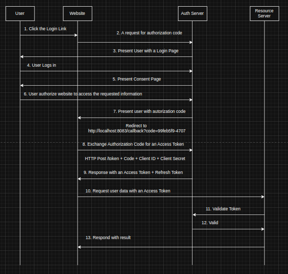

### Grant Type
Grant Type is a way client application gets an access token. For different types application have different Grant types given.

**Based on the OAuth 2.0 specification, there are several grant types. Here are the main types:**

### 1. Authorization Code Grant

    Most secure flow
    Used by server-side web applications
    Requires ability to store client secret securely
    Involves redirect URIs

### 2. PKCE Enhanced Authorization Code Grant

    Used by:
    Single Page Applications (SPAs)
    Mobile apps
    Native applications
    More secure than plain Authorization Code for public clients
    Prevents authorization code interception attacks
    
### 3. Client Credentials Grant

    Used for machine-to-machine (M2M) communication
    No user interaction required
    Used by confidential clients only
    Example: Microservices communication

### 4. Password Grant Type (Resource Owner Password Credentials)

    Legacy/deprecated
    Used only when redirect flows aren't possible
    Not recommended for new applications
    Requires direct handling of user credentials

### 5. Refresh Token Grant

    Used to obtain new access tokens
    Prevents need for re-authentication
    Typically used with other grant types
    Requires offline_access scope

### 6. Device Code Grant

    Used by devices with limited input capabilities
    Examples: Smart TVs, IoT devices
    Involves user completing auth on secondary device

### 7. Implicit Grant

    Legacy flow
    Deprecated in OAuth 2.1
    Replaced by Authorization Code + PKCE
    Not recommended for new applications


Server Side Web App - Authorization code
Server Side Script with no UI - Client Credentials
Javascript Single page App - PKCE Enhanced Autorization Code
Mobile Native App - Authorization Code / PKCE Enhanced Autorization Code
Device - Device code

#### Authorization code grant type
This is a redirection based flow. i.e using via google, facebook, linkedin, github etc.. The client application for example a website it must be capable of handling your right redirects from the authorization server and additionally being able to handler your redirects, the client application must be able to securely store oauth client secret that it will be using when exchanging the authorization code for an access token and if the client application doesn't guarntee the confidentiality of Oauth secret key, the it should not use authorization code grant. Instead it should consider using PKCE enahnce authorization code and this flow is also pronounced pixie enhanced authorization code.


```
GET /authorize
?respons_type=code             // Required must be "code"
&state=hv8hfhshsha232djs       // Recommended
&redirect_uri={Redirect URI}   // Optional
&scope={Scopes}                // Optional
&client_id={Client Id}         // Required
```

```
POST https://{authorization-server-url}/token
?grant_type=authorization_code
&code={code}
&redirect_uri={redirect_uri}
&client_id={client_id}
&client_secret={client_secret}
```

##### Authorization code grant flow


#### PKCE Enhanced Autorization Code

***Proof Key for Code Exchange***
PKCE Enhanced Autorization Code grant flow builds upon the standard authorization code flow. This authorization flow is mostly used by native and Single Page Javascript apps, and it provides an additional level of security of applications that cannot keep it's OAuth client secret key safe. 

```
GET /authorize
?respons_type=code             // Required must be "code"
&state=hv8hfhshsha232djs       // Recommended
&redirect_uri={Redirect URI}   // Optional
&scope={Scopes}                // Optional
&client_id={Client Id}         // Required
&code_challenge=-sUEoAJSkeksame32kkdk42jsssmsmkkaakssskkxs
&code_challenge_method=S256
```

#### code_challenge: This is a transformed version of a secret code (called the code_verifier) that the client generates. Instead of sending the actual secret, the client sends this transformed value to the authorization server. The transformation is done using a hashing algorithm. The authorization server stores this code_challenge and associates it with the authorization request.

#### code_challenge_method: This parameter indicates the transformation (hashing) algorithm used to generate the code_challenge from the code_verifier. This tells the authorization server how to process the code_challenge it receives.

***`S256` is the recommended and most common value. It signifies that the SHA256 hashing algorithm was used.***

***`plain` is another possible value, but it's generally discouraged because it doesn't provide any real security benefit. If plain is used, the code_challenge is simply the code_verifier itself (unhashed).***


#### Generation of pkce code_verifier
```
import java.security.SecureRandom;
import java.util.Base64;

public class PKCEUtil {
    
    public static String generateCodeVerifier() {
        SecureRandom secureRandom = new SecureRandom();
        byte[] codeVerifier = new byte[32];
        secureRandom.nextBytes(codeVerifier);
        
        return Base64.getUrlEncoder()
                    .withoutPadding()
                    .encodeToString(codeVerifier);
    }
}
```

##### Explanation:

1. SecureRandom: Uses Java's cryptographically strong random number generator
2. byte[32]: Creates a 32-byte array which will result in a 43-character output after Base64URL encoding
3. Base64.getUrlEncoder(): Gets an encoder that uses the URL and Filename safe alphabet
4. withoutPadding(): Removes the padding character ('=') from the output
5. encodeToString(): Converts the byte array to a URL-safe Base64 string

The generated code verifier will meet the OAuth 2.0 PKCE requirements:

Length between 43 and 128 characters
Contains only alphanumeric characters and the special characters -, ., _, ~
Cryptographically random

#### Generation of pkce code_challenge 

```
import java.security.SecureRandom;
import java.util.Base64;

public class PKCEUtil {
    
    public static String generateCodeVerifier() {
        SecureRandom secureRandom = new SecureRandom();
        byte[] codeVerifier = new byte[32];
        secureRandom.nextBytes(codeVerifier);
        
        return Base64.getUrlEncoder()
                    .withoutPadding()
                    .encodeToString(codeVerifier);
    }
}
```

##### Explanation:
1. Input: Takes the previously generated code verifier as input
2. Process:
    Converts code verifier to ASCII bytes
    Creates SHA-256 hash of the bytes
    Base64URL encodes the hash
3. Output: Returns the code challenge string

***Important Notes:***

The code challenge is created using the S256 transformation method (SHA-256)
The resulting string is URL-safe and can be used in the authorization request
Store both the code verifier and challenge securely - you'll need the verifier later

### Client Credentials grant type (Machine to Machine requests)
In this case client application will most likely be a spring boot microservice
application running on server side. A spring boot microservice application that needs to 
request data from another another spring boot microservice. If one microservice
that needs to communicate with another microservice that doesn't have an access
token, it will then send the request to an authorization server to request an
access token. 


### Password Grant Type Authorization 
Password Grant Type Authorization should only be used when application doesn't
supports redirects. Otherwise if client application supports redirects then
we should use PKCE enahnced grant type or authorization code grant type. 


### Refresh Token grant type
It is used to exchange a refesh token for an access token. It allows client application to refresh expired access token for a new one and it allows client applications to continue to have a valid access token without any further interactions with an end user. So if access token gets expired they can refresh it and then continue interacting with the server side API using a newly refreshed access token. 


## How a resource server talks and verify access token?


***So how is Resource server able to verify users?*** 