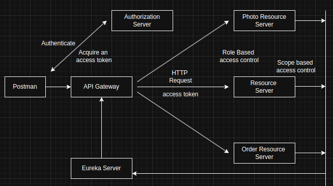
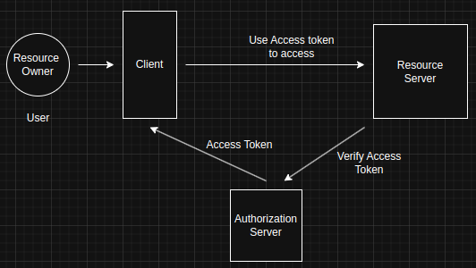
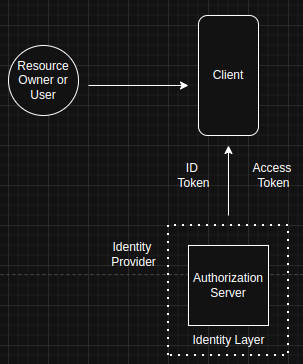

### OAuth2

#### What is OAuth2?

OAuth2 = Open + Authorization

#### OAuth2 Roles

*   **Resource Owner:** A user who is using a client application to access information on a resource server. The data being accessed belongs to this owner.
*   **Client:** An application that is accessing information on the user's behalf. This can be a web application, a mobile application, or even an HTTP client like Postman.
*   **Resource Server:** A server that hosts user information (e.g., Google, Facebook, LinkedIn, or a private server).
*   **Authorization Server:** The server that issues access tokens to the client application after successfully authenticating the resource owner and obtaining authorization.

#### OAuth2 Client Types

OAuth2 defines two client types based on their ability to authenticate securely with the authorization server:

1.  **Public:**
    *   Browser-based applications that cannot guarantee the safety of the client secret key and client ID.
    *   Run entirely in the browser window.
2.  **Confidential:**
    *   Applications that can securely store the client secret key.
    *   Registered with the authorization server as confidential clients and issued a secret access key.
    *   Able to securely authenticate with the authorization server using their client ID and client secret key.

#### OAuth2 Access Token

When a resource owner successfully authenticates with the authorization server and grants permission for a third-party application to access their data, the authorization server issues an access token to the client application. The client application uses this access token to communicate with the resource server to access the user's data.

To validate the access token, the resource server sends an HTTP request to the authorization server to ensure the token is valid. If the authorization server confirms the token's validity, the resource server processes the requested operation.

**Once client application has the access token, it can access user's data on Resource server on user's behalf without asking user for username and password anymore.**

**Therefore, the access token must be treated as sensitive information and kept secure. If the client application needs to store the access token, it must do so in a secure location. Furthermore, any HTTP requests using the access token must be made over a secure SSL connection.**

***Because of this the access token must be considered by a client appliction as a sensitive information and it must be kept secure, if the client application needs to store  access token, then it must store it in a secure location and when the access token is beign used in HTTP request, this HTTP request must be over a secure SSL connection.***

##### Access Token Types
The token may denote an identifier used to retrieve the authorization information or may self contain the authorization information in a verifiable manner(i.e a token string consistuing of some data and a signature)

1. Identifier Type
This type of token acts as a reference or pointer. It doesn't contain any authorization information itself. Instead, it's an identifier that the resource server can use to look up the associated authorization details from the authorization server.

2. Self Contain the authorization information
This type of token includes all the necessary authorization information within the token itself. A common example is a JSON Web Token (JWT). These tokens contain data (claims) and a signature, allowing the resource server to verify the token's authenticity and extract the authorization information without needing to consult the authorization server for every request.

It is seprated into three parts. 

Header: Contains metadata about the token, such as the type of token and the hashing algorithm used to sign it.

Payload: Contains the claims, which are statements about the user or client, and any other data that the resource server might need.

Signature: A cryptographic signature used to verify that the token hasn't been tampered with and that it was issued by a trusted authorization server.

#### OAuth2 and OpenID Connect
OpenID Connect is an additional layer on top of OAuth 2.0. It's an identity layer that provides client applications with identity information about the user. The authorization server that supports OpenID Connect and provides client applications with this identity information is also called an identity provider.

**When a user authenticates with the authorization server, the authorization server will issue and provide the client application with both an access token and an ID token. The ID token contains user identity information, allowing the client application to extract basic information about the currently authenticated user.**

So, the client application will have two tokens: the ID token and the access token. The ID token is used to validate the user's identity, confirming that they are who they claim to be. The access token, on the other hand, is used to validate if the user is authorized to access a requested resource from the resource server.

