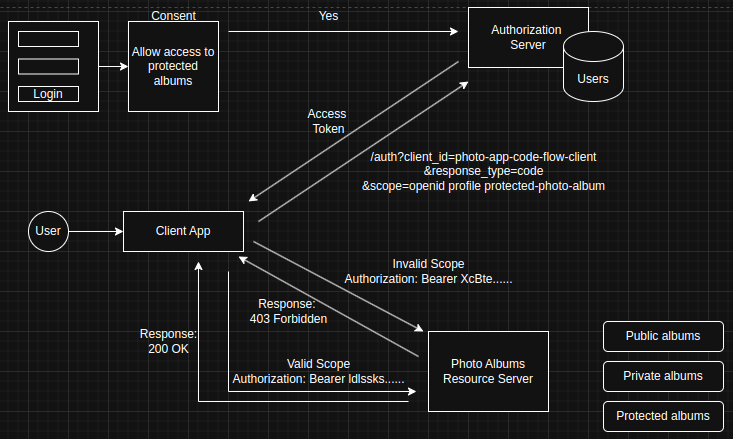

## Scope Based Access Control (SBAC)
Scope is a mechanism in OAuth 2.0 to limit an application's access to a user's account. An application can request one or more scopes, this information is then presented to the user in the consent screen, and the access token issued to the application will be limited to the scopes granted.

***An application can request one or more scopes and this information is then presented to user in the consent screen and the access token is issued to application, it will be limited to the scopes granted.***

### How it Works
1. Request Phase
```
GET /authorize
    ?client_id=CLIENT_ID
    &response_type=code
    &scope=profile email phone
```
2. Consent Phase
User sees requested scopes on consent screen
Can approve or deny specific permissions
Authorization server records granted scopes

3. Access Phase
```
{
  "access_token": "xyz...",
  "token_type": "Bearer",
  "expires_in": 3600,
  "scope": "profile email"  // Only granted scopes
}
```
```
Best Practices
Principle of Least Privilege

Request only necessary scopes
Split functionality into granular scopes
Clear Consent

Use descriptive scope names
Explain why each scope is needed
Scope Validation

Validate scopes on both client and server
Check scopes before performing actions
Documentation

Document available scopes
Explain purpose and usage of each scope
```

For example:- We've a user who is using a client application (a website, a desktop application or a mobile app), a resource server (photo album) and authorization server. A client application can request a list of user's photo albums from this resource server. 

There can be different types of photo album.
public photo,
private photo,
protected photo etc..

so for a client application to be able to get a list of protected photo albums from the resource server, it'll need to have access token, a client application needs to send a request to authorization server first. 

In the initial request, the client application will need to include scope, request parameter and the scope request parameter can contain one or more scopes that will specify what kind of information this client application would like to access. 


**Authorization server will then need to ask user a permission to issue an access token so it will be redirected user to login page to let them authenticate first and if the provided username and password is correct and the user successfully authenticates, the authorization server then present user with a consent screen where user will need to confirm that they allow this particular client application to access a list of albums on their behalf.**

### Scopes

#### openId
Informs authorization server that client application is making an OpenID connect request. This will also make Authorization server additionally to an access return an ID token. ID token will contain user information specified by scopes.

The openid scope is a special and fundamental scope in OpenID Connect (OIDC). Here's what you need to know:

1. Mandatory Scope
The openid scope is required for any OpenID Connect authentication flow

Its presence indicates that this is an OpenID Connect request rather than just OAuth2

2. Purpose
Tells the authorization server that the client application wants to authenticate the user

Triggers the generation of an ID Token in addition to the access token

Enables access to the user's basic identifier information


#### profile
Informs authorization server that client application would like to have an access to user profile details and in OpenID Connect. 

***The profile scope is a standardized scope in OpenID Connect that allows client applications to request access to the user's basic profile information. When a client application includes the profile scope in its authorization request, it's telling the authorization server (identity provider) that it wants to access the user's profile attributes.***

These profile attributes typically include basic user information such as:

Full name
Username
Profile picture
Birth date
Gender
Locale/Language preferences
Time zone
And other basic profile data

**Doesn't contain email**
This scope is particularly useful when building applications that need to personalize the user experience based on the user's identity information. For example, displaying the user's name and profile picture in the application's interface after they log in.

It's worth noting that the profile scope should be used in conjunction with the openid scope when working with OpenID Connect, as openid is the mandatory scope that indicates the authentication request should be processed as an OpenID Connect request rather than just OAuth2.

```
GET /authorize?
  response_type=code
  &client_id=CLIENT_ID
  &redirect_uri=REDIRECT_URI
  &scope=openid profile
```

4. Key Points
Often combined with other scopes like profile or email

Without openid, you only get OAuth2 authorization (access token)

With openid, you get both authorization and authentication (access token + ID token)

```
Key Points
# Basic authentication with profile info
scope=openid profile

# Authentication with profile and email
scope=openid profile email

# Full user information access
scope=openid profile email address phone
```
#### Email

When granted, the email scope gives access to two specific claims:

email: The user's email address
email_verified: Boolean indicating if the email has been verified

```
// Basic authorization request including email scope
GET /authorize?
  response_type=code
  &client_id=CLIENT_ID
  &redirect_uri=REDIRECT_URI
  &scope=openid email

///
{
  "sub": "248289761001",
  "email": "jane.doe@example.com",
  "email_verified": true,
  "iss": "https://auth.example.com",
  "aud": "client_id"
}
```

1. Common Use Cases
User registration/login flows
Communication preferences
Account recovery
User notifications

2. Best Practices

Always combine with openid scope
Request only if email access is necessary
Handle both verified and unverified email states
Consider privacy implications
#### Address
When granted, the address scope gives access to a structured address claim containing:

Street address
Locality (city)
Region (state/province)
Postal code
Country

```
GET /authorize?
  response_type=code
  &client_id=CLIENT_ID
  &redirect_uri=REDIRECT_URI
  &scope=openid address

///
{
  "address": {
    "street_address": "123 Main St",
    "locality": "Anytown",
    "region": "State",
    "postal_code": "12345",
    "country": "US"
  }
}
```
Best Practices...

Always combine with openid scope
Request only when address information is necessary
Consider privacy regulations (GDPR, CCPA)
Validate addresses when critical for business logic
Store addresses securely if persistence is needed
#### Phone
The phone scope allows access to the user's phone number information.

What it Provides
When granted, the phone scope gives access to two specific claims:

phone_number: The user's phone number in E.164 format
phone_number_verified: Boolean indicating if the phone number has been verified

```
GET /authorize?
  response_type=code
  &client_id=CLIENT_ID
  &redirect_uri=REDIRECT_URI
  &scope=openid phone

{
  "sub": "248289761001",
  "phone_number": "+1-202-555-0101",
  "phone_number_verified": true,
  "iss": "https://auth.example.com",
  "aud": "client_id"
}
```
Common Use Cases
    Two-factor authentication (2FA)
    Account recovery
    Mobile app verification
    SMS notifications
    Contact information verification

Best Practices
    Always combine with openid scope
    Request only when phone access is necessary
    Handle both verified and unverified phone states
    Consider privacy regulations (GDPR, CCPA)
    Store phone numbers securely if persistence is needed
    Validate phone numbers in E.164 format
#### offline_access

The offline_access scope is used to request a refresh token that allows the application to maintain access even when the user is offline or not actively using the application.

Purpose
Enables long-term access to resources
Allows applications to refresh access tokens without user interaction
Useful for background processes and offline functionality

```
GET /authorize?
  response_type=code
  &client_id=CLIENT_ID
  &redirect_uri=REDIRECT_URI
  &scope=openid offline_access
```

### How it Works
When granted, the authorization server provides:

Access token
    Refresh token
    ID token (if openid scope is included)

Common Use Cases
    Mobile applications
    Background services
    Scheduled tasks
    Data synchronization
    IoT devices
    Long-running processes

Best Practices
    Only request when truly needed
    Store refresh tokens securely
    Implement token rotation
    Handle refresh token expiration
    Monitor refresh token usage
    Implement proper error handling for token refresh failures

Security Considerations
    Refresh tokens are long-lived credentials
    Must be stored securely (encrypted)
    Should be rotated periodically
    Access should be revoked when no longer needed
    Monitor for suspicious usage patterns

